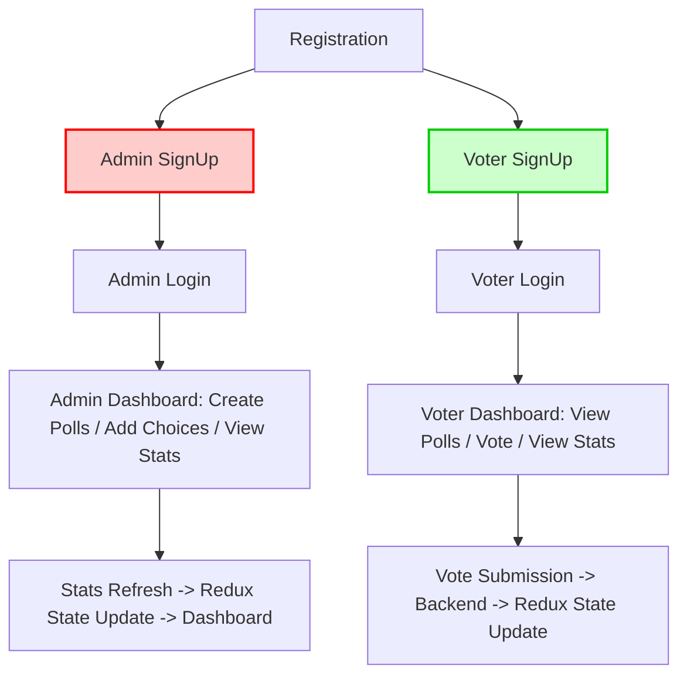

# Pollify – Full-Stack Online Polling System


## **Project Overview**

Pollify is a **role-based polling system** built as a full-stack application:

- **Admins** create and manage polls.
- **Voters** can vote on polls assigned to them and view live statistics.
- **Frontend** built with React/Next.js and **Redux** for state management.
- **Backend** built with Django REST Framework, JWT authentication, and live poll stats.

Pollify ensures **secure voting**, **role-based access**, and **real-time updates** for users.

---

## **Key Features**

- **Role-based Authentication**

  - Separate registration and login flows for Admins and Voters.
  - JWT authentication for secure sessions.

- **Admin Features**

  - Create, edit, and toggle polls.
  - Add and manage poll choices.
  - View live statistics for their polls.

- **Voter Features**

  - See only active polls from assigned admin.
  - Vote once per poll.
  - View live poll statistics.

- **Frontend Features**

  - **Redux** for global state management (user session, polls, votes).
  - Dynamic UI updates as polls and votes change.
  - Separate dashboards for Admin and Voter roles.

- **Backend Features**

  - Role-based API endpoints with permissions.
  - One vote per poll per voter enforced at database level.
  - API documentation via Swagger and Redoc.

---

## **Tech Stack**

| Layer              | Technology                                          |
| ------------------ | --------------------------------------------------- |
| **Frontend**       | React / Next.js, Redux Toolkit, Axios, Tailwind CSS |
| **Backend**        | Django 5.2, Django REST Framework                   |
| **Authentication** | JWT via djangorestframework-simplejwt               |
| **Database**       | SQLite (dev), PostgreSQL (prod)                     |
| **API Docs**       | DRF Spectacular (Swagger / Redoc)                   |
| **Deployment**     | Docker / Vercel / Heroku optional                   |

---

## **Project Structure**

```
pollify/
├─ backend/                   # Django backend
│  ├─ core/                   # App: models, serializers, views, permissions
│  ├─ pollify_api/            # Project settings
│  ├─ manage.py
├─ frontend/                  # React/Next.js frontend
│  ├─ pages/                  # Pages for Admin and Voter dashboards
│  ├─ components/             # Reusable UI components
│  ├─ redux/                  # Redux store, slices (user, polls, votes)
│  ├─ api/                    # Axios API calls
│  ├─ public/                 # Static assets
├─ docs/                      # Screenshots and documentation
├─ requirements.txt           # Backend dependencies
├─ package.json               # Frontend dependencies
└─ README.md
```

---

## **Setup Instructions**

### **Backend**

```bash
cd backend
python -m venv venv
source venv/bin/activate  # Linux/macOS
venv\Scripts\activate     # Windows
pip install -r requirements.txt
python manage.py makemigrations
python manage.py migrate
python manage.py runserver
```

### **Frontend**

```bash
cd frontend
npm install
npm run dev
```

- Make sure the frontend API URL matches your backend:

```env
NEXT_PUBLIC_API_URL=http://localhost:8000/api/
```

---

## **Frontend & Redux Flow**

- **User authentication**

  - Redux slice stores `user` info and JWT token.
  - Axios interceptors attach token to API calls.

- **Polls**

  - Redux slice fetches polls for the dashboard.
  - Voters see only polls from their assigned admin.

- **Voting**

  - Vote action triggers API call.
  - Redux state updates automatically to reflect new vote counts.

- **Stats**

  - Poll stats fetched from backend and stored in Redux for live display.

---

## **Roles & Permissions**

| Role      | Frontend Dashboard | Backend Access                               |
| --------- | ------------------ | -------------------------------------------- |
| **Admin** | Poll management UI | Create/manage polls, add choices, view stats |
| **Voter** | Poll voting UI     | View active polls, vote once, view stats     |

---

## **API Overview**

### Authentication

- `POST /api/auth/register/admin/` – Admin registration
- `POST /api/auth/register/voter/` – Voter registration
- `POST /api/auth/login/admin/` – Admin login
- `POST /api/auth/login/voter/` – Voter login

### Polls

- `GET /api/polls/` – Fetch polls (filtered by role)
- `POST /api/polls/` – Admin creates a poll
- `PATCH /api/polls/<id>/` – Admin updates a poll
- `GET /api/polls/<id>/stats/` – Live poll stats

### Choices

- `POST /api/choices/` – Admin adds a choice
- `GET /api/choices/` – List choices with vote counts

### Voting

- `POST /api/vote/` – Voter casts a vote (one per poll)

---

## **Mermaid Flowchart**



---

## **Contributing**

1. Fork the repository
2. Create a feature branch
3. Commit and push changes
4. Open a Pull Request

---

## **License**

MIT License © 2025 Chiamaka Uyanna
