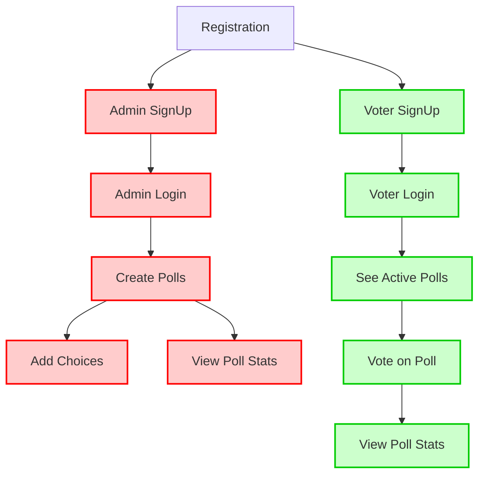

# Pollify – Online Polling System


## **Project Overview**

Pollify is an online polling system where **admins create polls** and **voters cast votes**.
It supports role-based authentication, live statistics, and ensures voters can only access polls from their assigned admin.

### **Features**

- **Role-based registration and login** (Admin or Voter)
- **Admin functionality:**

  - Create polls
  - Add choices to polls
  - View live poll statistics

- **Voter functionality:**

  - View active polls from their assigned admin
  - Vote once per poll
  - View live stats of accessible polls

- **Secure voting** with one-vote-per-poll enforcement
- **JWT authentication** for both Admin and Voter

---

## **Tech Stack**

- **Backend:** Django 5.2, Django REST Framework
- **Authentication:** JWT via `djangorestframework-simplejwt`
- **Database:** SQLite (can switch to PostgreSQL for production)
- **API Docs:** DRF Spectacular (Swagger / Redoc)
- **Frontend:** Next.js

---

## **Setup**

1. Clone the repo:

```bash
git clone https://github.com/chiamakauyanna/pollify.git
cd pollify
```

2. Create a virtual environment and install dependencies:

```bash
python -m venv venv
source venv/bin/activate  # Linux/macOS
venv\Scripts\activate     # Windows
pip install -r requirements.txt
```

3. Apply migrations:

```bash
python manage.py makemigrations
python manage.py migrate
```

4. Create a superuser (optional for admin access via Django admin):

```bash
python manage.py createsuperuser
```

5. Run the development server:

```bash
python manage.py runserver
```

6. Access API docs:

- Swagger: `http://127.0.0.1:8000/api/docs/`
- Redoc: `http://127.0.0.1:8000/api/redoc/`

---

## **API Endpoints**

### **Authentication**

| Endpoint                    | Method | Role  | Description                                   |
| --------------------------- | ------ | ----- | --------------------------------------------- |
| `/api/auth/register/admin/` | POST   | Admin | Register a new admin                          |
| `/api/auth/register/voter/` | POST   | Voter | Register a new voter (auto-assigned to admin) |
| `/api/auth/login/admin/`    | POST   | Admin | Admin login                                   |
| `/api/auth/login/voter/`    | POST   | Voter | Voter login                                   |
| `/api/token/refresh/`       | POST   | All   | Refresh JWT token                             |

### **Polls**

| Endpoint                 | Method | Role  | Description                                                   |
| ------------------------ | ------ | ----- | ------------------------------------------------------------- |
| `/api/polls/`            | GET    | All   | List polls (voters only see active polls from assigned admin) |
| `/api/polls/`            | POST   | Admin | Create a new poll                                             |
| `/api/polls/<id>/`       | GET    | All   | Get poll details                                              |
| `/api/polls/<id>/`       | PATCH  | Admin | Update poll (e.g., toggle `is_active`)                        |
| `/api/polls/<id>/stats/` | GET    | All   | Live poll stats                                               |

### **Choices**

| Endpoint             | Method       | Role  | Description                    |
| -------------------- | ------------ | ----- | ------------------------------ |
| `/api/choices/`      | GET          | All   | List choices (with vote count) |
| `/api/choices/`      | POST         | Admin | Create a choice for a poll     |
| `/api/choices/<id>/` | PATCH/DELETE | Admin | Update/Delete a choice         |

### **Voting**

| Endpoint     | Method | Role  | Description                |
| ------------ | ------ | ----- | -------------------------- |
| `/api/vote/` | POST   | Voter | Cast a vote (one per poll) |

---

## **Roles and Permissions**

| Role      | Capabilities                                                          |
| --------- | --------------------------------------------------------------------- |
| **Admin** | Create/manage polls and choices, view stats, cannot vote              |
| **Voter** | View active polls from assigned admin, vote once per poll, view stats |

---

## **Mermaid Flowchart**



- **Red boxes** = Admin-only actions
- **Green boxes** = Voter actions

> Mermaid diagrams can be rendered directly in GitHub README if you enable Mermaid support, or use tools like VS Code with Mermaid preview.

---

## **Database Models**

- **User**: `username`, `email`, `role`, `unique_id`, `voter_id` (for voters only)
- **Poll**: `title`, `description`, `created_by`, `is_active`, `start_at`, `end_at`
- **Choice**: `poll`, `text`
- **Vote**: `poll`, `choice`, `voter` (unique per poll)

---

## **License**

MIT License © 2025 Chiamaka Uyanna
